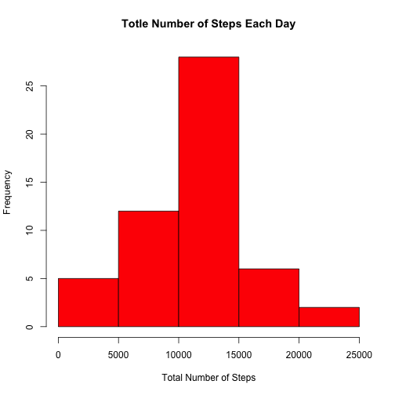
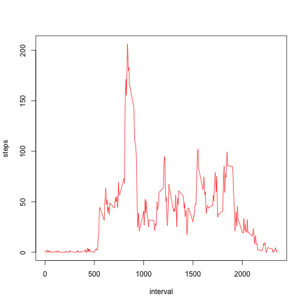
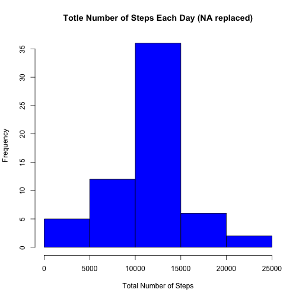
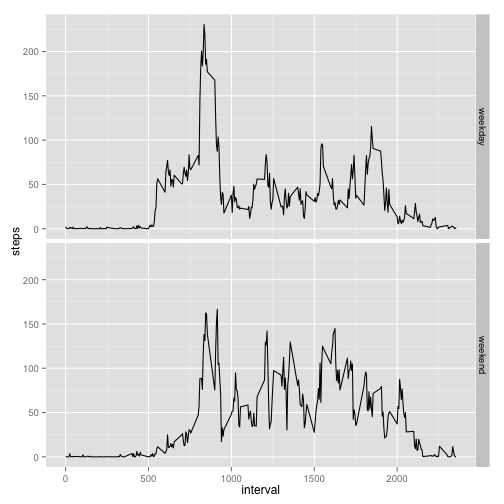

## Personal Activity Monitoring Data Report

*This report is written for the first peer assignment of the Reproducible Research course offered by Johns Hopkins Bloomberg School of Public Health through Coursera. Detailed information about the dataset is described in the README.md file in this repositary.* 

### First, download the data if the dataset is not already in the working directory, and read the data into R:


```r
if(!(file.exists("activity.csv"))) {
  fileUrl <- "https://d396qusza40orc.cloudfront.net/repdata%2Fdata%2Factivity.zip"
  download.file(fileUrl, "activity.zip", method="curl")
  unzip("./activity.zip")
}
DT <- read.csv("activity.csv") 
```

### Analyze the mean and median of the total number of steps taken each day.

Calculate the total number of steps taken per day, by ignoring the missing data (which is the default of the na.action option of the "aggregate" function): 


```r
sum_by_day <- aggregate(steps ~ date, DT, sum)
```

Here is a histogram of of the total number of steps taken each day:


```r
hist(sum_by_day$steps,col="red",main="Totle Number of Steps Each Day", xlab="Total Number of Steps")
```

 

Calculate the mean and median of the total number of steps taken each day:


```r
mean(sum_by_day$steps) # the mean
```

```
## [1] 10766.19
```

```r
median(sum_by_day$steps) # the median
```

```
## [1] 10765
```

### Analyze the average daily activity pattern.

Calculate the average number of steps taken for each 5-minute interval, averaged across all days:


```r
avg_by_interval <- aggregate(steps ~ interval, DT, mean)
```

Here is a time series plot of the average number of steps taken:


```r
with(avg_by_interval, plot(interval,steps,col="red",type="l"))
```

 

Find the 5-minute interval that contains the maximum number of steps averaged across all the days:


```r
max_steps <- max(avg_by_interval$steps) # the maximum of the average number of steps taken per interval
max_interval <- avg_by_interval$interval[which.max(avg_by_interval$steps)] # the 5-minute interval
                                                                        # that contains the maximum 
```

**The maximum of the average number of steps is 206.1698113, which is taken during the 5-minute interval of 835.**

### Imputting missing values.

Calculate the total number of missing values in the dataset:

```r
sumNA <- sum(is.na(DT$steps))
percentNA <- sumNA/length(DT$steps)
```

**The total number of missing values is 2304, and the percentage of missing values is 0.1311475 of the total available data. This is quite significant, and the presence of missing data may introduce bias into some calculations or summaries of the data. Based on the analysis of the average daily activity pattern above, the activity varies for different time intervals throughout the day. Thus, I use the average number of steps for each 5-minute interval (calculated above) to replace the missing values in the corresponding interval, with the following R code:**


```r
original_steps <- DT$steps
na_checker <- is.na(DT$steps) # a logical vector indicating where NAs are in the original data
original_steps[na_checker] <- 0 # replace NA by "0" to enable arithmetic operations below
number_of_days <- length(unique(DT$date)) # total number of days in the original dataset
rep_avg_steps <- rep(avg_by_interval$steps, number_of_days) # repeat the vector storing the
                            # average number of steps taken for each interval for the same
                            # number of days to match the same length of the original_steps vector
steps_NAreplaced <- (rep_avg_steps * na_checker) + (original_steps * !na_checker) # replace NA with
                    # the average number of steps for each interval, by combinging the rep_avg_steps
                    # and original_steps vectors using the logical vectors as coefficients
```

Create a new dataset that is equal to the original dataset but with the missing data replaced by the average number of steps for each 5-minute interval:

```r
DT2 <- DT
DT2$steps <- steps_NAreplaced # DT2 is the desired new dataset
```

Here's a histogram of the total number of steps taken each day:


```r
sum_by_day2 <- aggregate(steps ~ date, DT2, sum)
hist(sum_by_day2$steps,col="blue",main="Totle Number of Steps Each Day (NA replaced)", 
     xlab="Total Number of Steps")
```

 

Calculate the mean and median total number of steps taken per day:


```r
mean(sum_by_day2$steps) # mean
```

```
## [1] 10766.19
```

```r
median(sum_by_day2$steps) # median
```

```
## [1] 10766.19
```

**The mean is identical to the mean of the original data with missing values, and now the median is identical to the mean too. This is easily understood. Since I replaced the missing values with the average number of steps for each 5-minute interval, the average number of steps taken daily becomes the number of steps taken during each missing day in the original dataset. Therefore, imputing missing data by this strategy does not change the estimates of the total daily number of steps on average.**

### Investigate the differences in activity patterns between weekdays and weekends.

Create a new factor variable in the dataset with two levels – “weekday” and “weekend” indicating whether a given date is a weekday or weekend day:


```r
DT2$day <- weekdays(as.Date(DT2$date))
DT2$whatday <- "weekday"
DT2$whatday[DT2$day == "Saturday" | DT2$day == "Sunday"] <- "weekend"
DT2$whatday <- as.factor(DT2$whatday) # "whatday" column contains the desired factor variable
```

Here's a panel plot containing a time series plot of the number of steps taken averaged across all weekday days (upper panel) or weekend days(lower panel):


```r
avg_by_interval_whatday <- aggregate(steps ~ interval + whatday, DT2, mean)
library(ggplot2)
qplot(interval,steps,data=avg_by_interval_whatday,geom=c("line"),facets=whatday~.)
```

 

**There are differences in the activity patterns between weekdays and weekends. The activity pattern clearly shows a major peak during the early part of the day in weekdays, while the activity is more evenly distributed throughout the day in weekends than in weekdays.**
